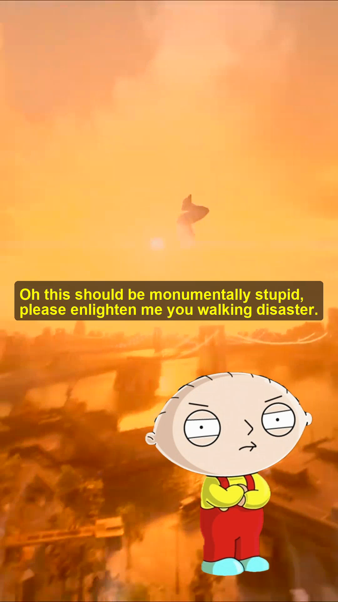

# Short Video MCP Server

**Stop reading long AI answers. Watch them instead.**

Turn any Claude answer, PDF, PowerPoint, email, or topic into a TikTok-style short video narrated by **Peter Griffin** and **Stewie Griffin** — with gameplay background, character animations, and synced captions.



## Why?

Claude just gave you a 2-page answer? Don't read it. Say **"generate a short video"** and Peter and Stewie will explain it to you in 60 seconds.

**This isn't limited to one use case.** It turns *any* answer into a video:

- **Don't want to read Claude's long answer?** → Just add "generate a short video" and watch it instead
- **Got a 60-slide PowerPoint from your teacher?** → Upload it, ask Claude to generate a video for each slide — now scroll through short videos instead of slides
- **Want to study from a PDF?** → Upload it, generate a video — every key fact, date, and detail is included so you don't miss anything
- **Have a Gmail MCP set up?** → Ask Claude to read your inbox and generate a short video — Peter and Stewie catch you up on your emails
- **Morning briefing?** → Set up a schedule and get a daily video recap of your news, inbox, and Whoop health stats narrated by Peter and Stewie
- **Any LLM answer, anywhere** → Works with Claude Desktop, Claude Code, or any MCP-compatible client

For studying, it covers **every important detail** — names, dates, numbers, key takeaways — nothing gets skipped. The humor just makes it stick.

## How It Works

```
You ask a question → Claude answers → generate_short_video is called
                                            │
                                            ├── 1. Script: Claude writes a Peter/Stewie dialogue
                                            ├── 2. Audio: ElevenLabs generates voice for each line
                                            └── 3. Video: FFmpeg assembles the final MP4
                                                    ├── Random gameplay background
                                                    ├── Character PNGs with emotion overlays
                                                    └── Timed captions synced to audio
```

**Output:** A 30-90 second portrait MP4 that auto-opens when done.

## Quick Setup

### Prerequisites

| Requirement | How to get it |
|---|---|
| **Python 3.10+** | [python.org](https://www.python.org/downloads/) |
| **FFmpeg** | `brew install ffmpeg` (macOS) or `sudo apt install ffmpeg` (Linux) |
| **Anthropic API key** | [console.anthropic.com](https://console.anthropic.com/) |
| **ElevenLabs API key** | [elevenlabs.io](https://elevenlabs.io/) (free tier works) |

### 1. Clone and install

```bash
git clone https://github.com/matedort/short-video-mcp.git
cd short-video-mcp
pip install -r requirements.txt
```

### 2. Configure API keys

```bash
cp .env.example .env
# Edit .env with your API keys and ElevenLabs voice IDs
```

Your `.env` should look like:
```
ANTHROPIC_API_KEY=sk-ant-api03-your-key-here
ELEVENLABS_API_KEY=sk_your-elevenlabs-key-here
PETER_VOICE_ID=your-peter-voice-id
STEWIE_VOICE_ID=your-stewie-voice-id
```

**Finding voice IDs:** Go to [elevenlabs.io/voice-library](https://elevenlabs.io/voice-library), find voices you like, add them to your account, then copy the voice ID from the voice settings. Any two voices work — pick a deep one for Peter and a higher-pitched one for Stewie.

### 3. Add assets

Place your files in:
```
assets/
├── background/          ← .mp4 gameplay videos (at least one)
│   ├── subwaysurfers.mp4
│   ├── minecraft.mp4
│   └── ...
└── characters/          ← Character PNGs
    ├── peter.png        ← Required
    ├── stewie.png       ← Required
    ├── peter_excited.png    ← Optional emotion variants
    ├── peter_confused.png
    ├── peter_teaching.png
    ├── stewie_angry.png
    └── stewie_excited.png
```

Background videos should be **portrait orientation** (or they'll be cropped to fit). Character PNGs should have **transparent backgrounds**.

### 4. Connect to Claude

**Claude Desktop** — add to `~/Library/Application Support/Claude/claude_desktop_config.json` (macOS) or `%APPDATA%\Claude\claude_desktop_config.json` (Windows):

```json
{
  "mcpServers": {
    "short-video": {
      "command": "python3",
      "args": ["/full/path/to/short-video-mcp/server.py"],
      "env": {}
    }
  }
}
```

**Claude Code** — add to `~/.claude.json` under `mcpServers`:

```json
{
  "mcpServers": {
    "short-video": {
      "command": "python3",
      "args": ["/full/path/to/short-video-mcp/server.py"],
      "env": {}
    }
  }
}
```

Then restart Claude.

## Usage Examples

**Basic — any question:**
> "Explain quantum computing and generate a short video about it"

**PDF studying:**
> *[Upload PDF]* "Summarize this and generate a short video — include every key detail"

**PowerPoint slides:**
> *[Upload PPT]* "Generate a short video for each slide so I can scroll through them"

**Email catch-up (with Gmail MCP):**
> "Read my inbox and generate a short video summarizing my unread emails"

**Morning briefing (with scheduled tasks):**
> "Every morning at 8am, read my inbox, check my Whoop stats, and generate a short video briefing"

**Claude Code output:**
> *[After Claude makes code changes]* "Generate a short video explaining what you just changed"

## Master Prompt (One-Click Setup)

Copy and paste this prompt into **Claude Code** or **Claude Desktop** to set everything up automatically:

```
I want to set up the short-video MCP server from GitHub.

Before you start, I need to confirm:
1. Do you have an Anthropic API key? (get one at console.anthropic.com)
2. Do you have an ElevenLabs API key? (get one at elevenlabs.io — free tier works)

Once confirmed, please:
1. Clone https://github.com/matedort/short-video-mcp.git to my home directory
2. Run: pip install -r requirements.txt
3. Create the .env file from .env.example and ask me for my API keys and voice IDs
4. Ask me to provide background gameplay videos (.mp4) and character PNGs, or help me find/download some
5. Add the short-video MCP server to my Claude config:
   - Claude Desktop: ~/Library/Application Support/Claude/claude_desktop_config.json
   - Claude Code: ~/.claude.json
   Use the full path to server.py with python3 as the command
6. Tell me to restart Claude, then test it with: "Explain why pizza is the best food and generate a short video about it"
```

## Project Structure

```
short-video-mcp/
├── server.py            ← MCP server (the only code file)
├── requirements.txt     ← Python dependencies
├── .env.example         ← Template for API keys
├── .env                 ← Your actual API keys (git-ignored)
├── assets/
│   ├── background/      ← Gameplay videos (.mp4)
│   └── characters/      ← Character PNGs with transparent backgrounds
├── output/              ← Generated videos land here (git-ignored)
└── docs/
    └── example_screenshot.png
```

## How the Video is Built

1. **Script Generation** — Claude (via Anthropic API) writes a dialogue between Peter and Stewie that covers all the key information from your content, staying in character with humor. For studying, every fact is included — nothing gets skipped.
2. **Voice Synthesis** — Each dialogue line is sent to ElevenLabs TTS with the corresponding voice ID, then all segments are concatenated.
3. **Video Assembly** — FFmpeg composites everything:
   - Background gameplay video (randomly selected, looped)
   - Character PNGs positioned bottom-left (Stewie) and bottom-right (Peter)
   - Characters appear/disappear based on who's speaking, with emotion-specific images
   - Caption text rendered as overlays, centered and synced to audio timing

## Configuration

| Environment Variable | Description |
|---|---|
| `ANTHROPIC_API_KEY` | Your Anthropic API key for script generation |
| `ELEVENLABS_API_KEY` | Your ElevenLabs API key for voice synthesis |
| `PETER_VOICE_ID` | ElevenLabs voice ID for Peter Griffin |
| `STEWIE_VOICE_ID` | ElevenLabs voice ID for Stewie Griffin |

## Troubleshooting

| Issue | Fix |
|---|---|
| `ffmpeg not found` | Install FFmpeg: `brew install ffmpeg` (macOS) or `sudo apt install ffmpeg` (Linux) |
| `ANTHROPIC_API_KEY not set` | Create `.env` from `.env.example` and add your key |
| Voice sounds wrong | Try different ElevenLabs voice IDs — browse the [voice library](https://elevenlabs.io/voice-library) |
| Video takes too long | Use shorter content, or the server uses `ultrafast` FFmpeg preset by default |
| Claude says "credits" or "quota" | That's Claude hallucinating — there's no credit system. The server runs locally. Just retry. |
| Server not showing in Claude | Make sure the path in your config is absolute and points to `server.py`. Restart Claude fully (Cmd+Q). |

## Acknowledgments

This project was inspired by [HackEmory-backend](https://github.com/Jayyk09/HackEmory-backend) by [@Jayyk09](https://github.com/Jayyk09) — the original hackathon project that proved AI-generated short videos with cartoon characters could actually work. Their approach to character overlays, TTS narration, and video assembly laid the groundwork for this MCP server. Huge thanks for making it open source and sparking the idea.

Built with:
- [Anthropic Claude API](https://www.anthropic.com/) — script generation
- [ElevenLabs](https://elevenlabs.io/) — voice synthesis
- [FFmpeg](https://ffmpeg.org/) — video assembly
- [Model Context Protocol (MCP)](https://modelcontextprotocol.io/) — Claude integration

## License

MIT
